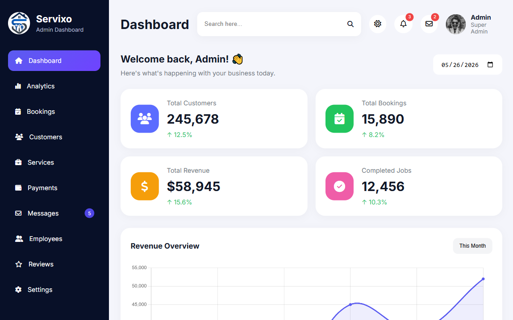
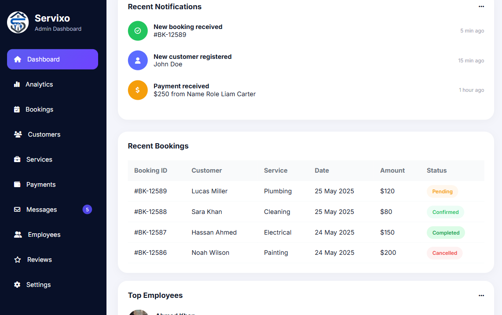
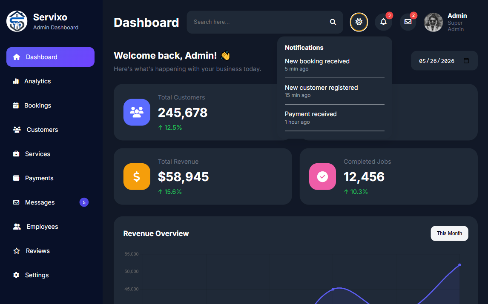
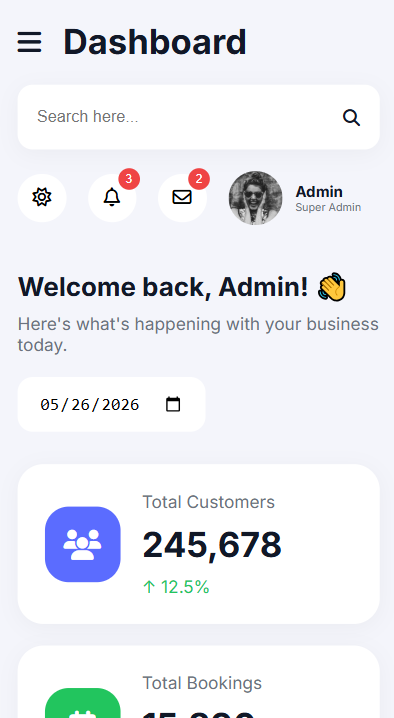
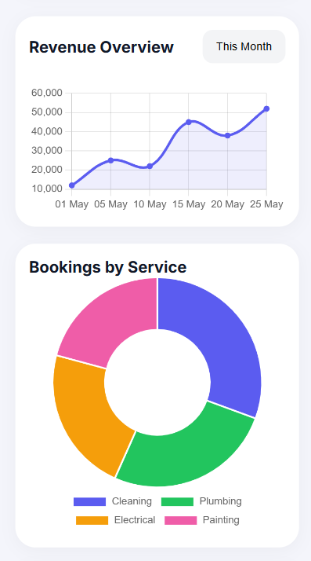
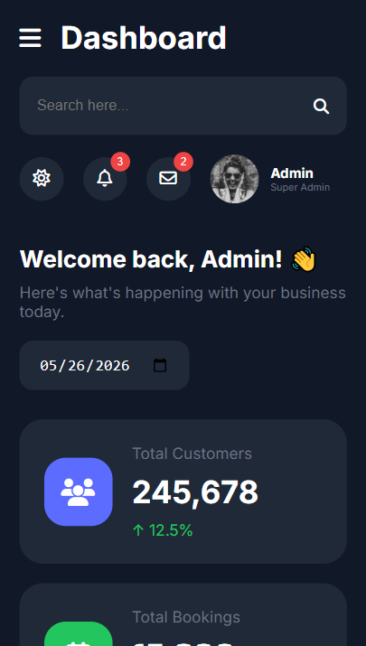

# 🚀 Servixo Dashboard

A modern and fully responsive admin dashboard built with **HTML, CSS, and JavaScript**.  
This dashboard is designed for home service businesses and includes analytics, bookings management, notifications, charts, employees, and interactive UI components.

---

## 📸 Preview

### Desktop View

  
  
  

### Mobile View

  
  
  

# 🌐 Live Demo

🔗 https://servixo-dashboard.netlify.app/

---

# ✨ Features

## ✅ Responsive Design
Fully optimized for:
- Desktop
- Tablet
- Mobile devices

---

## ✅ Interactive Sidebar
- Active navigation
- Mobile toggle menu

---

## ✅ Dashboard Analytics
- Revenue overview
- Customer statistics
- Booking analytics
- Service distribution charts

---

## ✅ Search Functionality
Live table filtering using JavaScript.

---

## ✅ Notification System
Interactive notifications dropdown.

---

## ✅ Dark Mode
Toggle between light and dark themes.

---

## ✅ Charts & Graphs
Built using:

- Chart.js

Official Website:  
https://www.chartjs.org/

---

## ✅ Employee Section
Professional employee cards with ratings.

---

## ✅ Booking Management Table
Includes:
- Customer names
- Service details
- Status badges
- Booking amounts

---

# 🛠 Technologies Used

## Frontend
- HTML5
- CSS3
- JavaScript (ES6)

---

## Libraries & Tools

### Chart.js
https://www.chartjs.org/

### Font Awesome
https://fontawesome.com/

### Google Fonts (Inter)
https://fonts.google.com/specimen/Inter

---

# 👨‍💻 Developer

Developed by Muhammad Zeeshan Khan